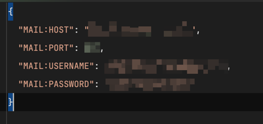
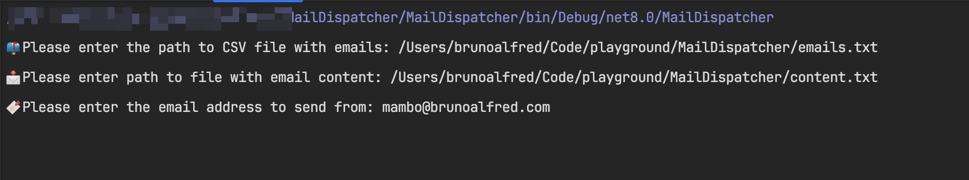

### MailDispatcher - A simple mail dispatcher

This is a simple mail dispatcher that uses the `System.Net.Mail` library to send emails.

#### Setup

Provide the following environment variables as credentials to the SMTP server:



#### Usage

Just like any other .NET Core application, you can build and run the application using the following commands:

```csharp
dotnet build

dotnet run
```

Since its a console application, you should expect few prompts,



#### License

This project is licensed under the MIT License - see the [LICENSE.md](https://opensource.org/license/mit/) file for details.

Ping me at [mambo@brunoalfred.com](mailto:mambo@brunoalfred.com) for any queries.

